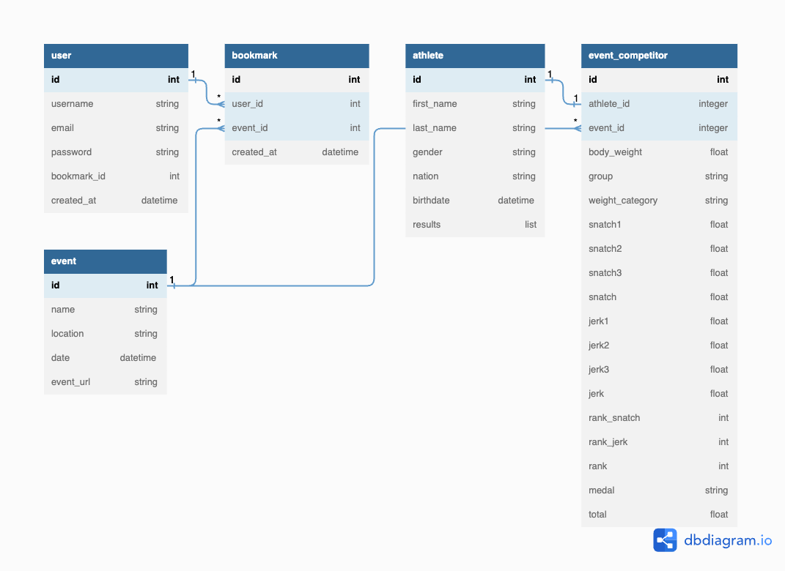
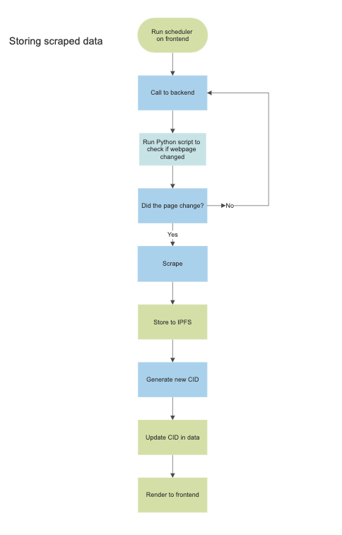

# twler





## Installation

In root directory, run the following command to start both React web client and Django restful api.

```
docker-compose up -d --build
```

- Check [port 3000](http://localhost:3000/) and [port 8000](http://localhost:8000/) to see if they are working.

- Run `docker-compose down` to stop the docker containers.

#### To create Django superuser, run the following:

```
docker-compose exec api python3 manage.py migrate
docker-compose exec api python3 manage.py createsuperuser
```

- Visit [Django admin page](http://localhost:8000/admin) and login to superuser.
